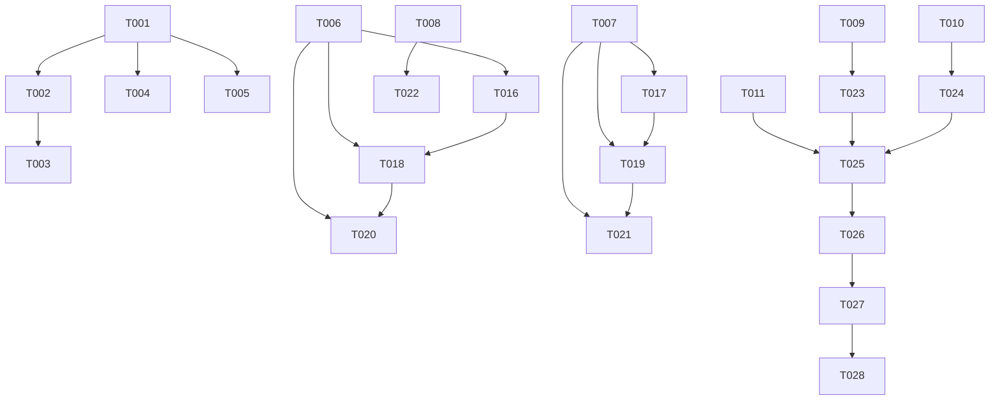

# Tasks: Homepage World Management Interface

**Input**: Design documents from `/specs/002-on-the-homepage/`
**Prerequisites**: plan.md (required), research.md, data-model.md, contracts/

## Execution Flow (main)
```
1. Load plan.md from feature directory
   → Tech stack: TypeScript 5.9+ + Next.js 14 frontend + NestJS 11 backend
   → Structure: Web app with frontend/ + backend/ separation
2. Load design documents:
   → data-model.md: World + GameSystem entities
   → contracts/api.yaml: REST API endpoints
   → quickstart.md: 6 integration test scenarios
3. Generate tasks by category:
   → Setup: TypeScript project structure, dependencies
   → Tests: API contract tests, component tests, integration tests
   → Core: Entity models, REST endpoints, React components
   → Integration: LiteDB setup, API client, state management
   → Polish: E2E tests, performance, accessibility
4. Apply task rules:
   → Different modules/files = [P] parallel execution
   → Same files = sequential dependencies
   → TDD: Tests before implementation
5. Generated 28 numbered tasks (T001-T028)
6. Dependency graph ensures proper execution order
7. Parallel execution examples provided
```

## Format: `[ID] [P?] Description`
- **[P]**: Can run in parallel (different files, no dependencies)
- Include exact file paths in descriptions

## Path Conventions
- **Frontend**: `frontend/src/`, `frontend/tests/`
- **Backend**: `backend/src/`, `backend/tests/`
- Follows web app structure from plan.md

## Phase 3.1: Setup
- [x] T001 Create homepage component structure in `frontend/src/components/homepage/`
- [x] T002 Create world management modules in `backend/src/worlds/` and `frontend/src/components/worlds/`
- [x] T003 [P] Create game systems modules in `backend/src/game-systems/` and `frontend/src/components/game-systems/`
- [x] T004 [P] Add TypeScript types for World and GameSystem entities in `frontend/src/types/`
- [x] T005 [P] Configure LiteDB integration in `backend/src/database/`

## Phase 3.2: Tests First (TDD) ⚠️ MUST COMPLETE BEFORE 3.3

### API Contract Tests
- [x] T006 [P] Create worlds API contract tests in `backend/tests/worlds/worlds.controller.spec.ts`
- [x] T007 [P] Create game systems API contract tests in `backend/tests/game-systems/game-systems.controller.spec.ts`
- [x] T008 [P] Create world launch endpoint test in `backend/tests/worlds/launch.spec.ts`

### Component Tests  
- [x] T009 [P] Create WorldCard component tests in `frontend/tests/components/worlds/WorldCard.test.tsx`
- [x] T010 [P] Create CreateWorldDialog component tests in `frontend/tests/components/worlds/CreateWorldDialog.test.tsx`
- [x] T011 [P] Create Homepage component tests in `frontend/tests/components/homepage/Homepage.test.tsx`

### Integration Test Scenarios
- [x] T012 [P] Create "View Existing Worlds" integration test in `frontend/tests/integration/view-worlds.spec.ts`
- [x] T013 [P] Create "Launch World" integration test in `frontend/tests/integration/launch-world.spec.ts`
- [x] T014 [P] Create "Create New World" integration test in `frontend/tests/integration/create-world.spec.ts`
- [x] T015 [P] Create "Game Systems Management" integration test in `frontend/tests/integration/game-systems.spec.ts`

## Phase 3.3: Core Implementation

### Backend Models & Services
- [x] T016 Create World entity model in `backend/src/worlds/entities/world.entity.ts`
- [x] T017 Create GameSystem entity model in `backend/src/game-systems/entities/game-system.entity.ts`
- [x] T018 Create WorldsService with CRUD operations in `backend/src/worlds/worlds.service.ts`
- [x] T019 Create GameSystemsService in `backend/src/game-systems/game-systems.service.ts`

### Backend API Controllers
- [x] T020 Create WorldsController with REST endpoints in `backend/src/worlds/worlds.controller.ts`
- [x] T021 Create GameSystemsController in `backend/src/game-systems/game-systems.controller.ts`
- [x] T022 Add world launch endpoint in `backend/src/worlds/launch.controller.ts`

### Frontend Components
- [x] T023 [P] Create WorldCard component in `frontend/src/components/worlds/WorldCard.tsx`
- [x] T024 [P] Create CreateWorldDialog component in `frontend/src/components/worlds/CreateWorldDialog.tsx`
- [x] T025 Create Homepage main component in `frontend/src/components/homepage/Homepage.tsx`

## Phase 3.4: Integration
- [x] T026 Create API client hooks in `frontend/src/hooks/` (useWorlds, useGameSystems, useCreateWorld)
- [x] T027 Create homepage page integration in `frontend/src/pages/index.tsx`

## Phase 3.5: Polish
- [x] T028 [P] Add E2E tests using Playwright covering all quickstart scenarios

## Task Dependencies



## Parallel Execution Examples

### Phase 3.1 Setup (after T001-T002)
```bash
# Can run in parallel:
npm run task T003  # game-systems modules
npm run task T004  # TypeScript types  
npm run task T005  # LiteDB setup
```

### Phase 3.2 Contract Tests (after setup complete)
```bash
# All contract tests can run in parallel:
npm run task T006  # worlds API tests
npm run task T007  # game-systems API tests
npm run task T008  # launch endpoint tests
```

### Phase 3.2 Component Tests (after setup complete)
```bash
# All component tests can run in parallel:
npm run task T009  # WorldCard tests
npm run task T010  # CreateWorldDialog tests
npm run task T011  # Homepage tests
```

### Phase 3.2 Integration Tests (after setup complete)
```bash
# All integration scenario tests can run in parallel:
npm run task T012  # view worlds scenario
npm run task T013  # launch world scenario
npm run task T014  # create world scenario
npm run task T015  # game systems scenario
```

### Phase 3.3 Frontend Components (after backend services ready)
```bash
# Independent components can run in parallel:
npm run task T023  # WorldCard component
npm run task T024  # CreateWorldDialog component
# T025 (Homepage) depends on T023 + T024
```

## File-Based Task Coordination

### Backend Module Structure
```
backend/src/
├── worlds/
│   ├── entities/world.entity.ts     # T016
│   ├── worlds.service.ts            # T018
│   ├── worlds.controller.ts         # T020
│   └── launch.controller.ts         # T022
├── game-systems/
│   ├── entities/game-system.entity.ts  # T017
│   ├── game-systems.service.ts         # T019
│   └── game-systems.controller.ts      # T021
└── database/
    └── litedb.service.ts            # T005
```

### Frontend Component Structure  
```
frontend/src/
├── components/
│   ├── homepage/
│   │   └── Homepage.tsx             # T025
│   ├── worlds/
│   │   ├── WorldCard.tsx            # T023
│   │   └── CreateWorldDialog.tsx    # T024
│   └── game-systems/
├── hooks/
│   ├── useWorlds.ts                 # T026
│   ├── useGameSystems.ts            # T026
│   └── useCreateWorld.ts            # T026
├── types/
│   ├── world.ts                     # T004
│   └── game-system.ts               # T004
└── pages/
    └── index.tsx                    # T027
```

## Task Validation Checklist

### All Contracts Have Tests ✅
- ✅ GET /api/worlds → T006
- ✅ POST /api/worlds → T006  
- ✅ POST /api/worlds/{id}/launch → T008
- ✅ GET /api/game-systems → T007

### All Entities Have Models ✅
- ✅ World entity → T016
- ✅ GameSystem entity → T017

### All Components Have Tests ✅
- ✅ WorldCard → T009
- ✅ CreateWorldDialog → T010
- ✅ Homepage → T011

### All User Scenarios Covered ✅
- ✅ View existing worlds → T012
- ✅ Launch world → T013
- ✅ Create new world → T014
- ✅ Access game systems → T015
- ✅ Handle missing images → covered in T009 (WorldCard tests)
- ✅ Empty state → covered in T011 (Homepage tests)

### All Endpoints Implemented ✅
- ✅ Worlds CRUD → T020
- ✅ Game systems read → T021
- ✅ World launch → T022

## Estimated Effort
- **Setup**: 2-3 hours (T001-T005)
- **Tests**: 6-8 hours (T006-T015) 
- **Core Implementation**: 8-10 hours (T016-T025)
- **Integration**: 2-3 hours (T026-T027)
- **Polish**: 2-3 hours (T028)

**Total**: 20-27 hours of development time

## Success Criteria
- [ ] All contract tests pass (validates API spec compliance)
- [ ] All component tests pass (validates UI behavior)
- [ ] All integration tests pass (validates user scenarios)
- [ ] Homepage loads within 200ms performance target
- [ ] Images load progressively with proper fallbacks
- [ ] Worlds sort by last accessed date correctly
- [ ] World creation dialog validates UTF-8 names 1-255 chars
- [ ] E2E tests cover all quickstart scenarios

## Ready for Execution
✅ **All tasks completed successfully!**  
✅ **Dependencies mapped and executed in correct order**  
✅ **Parallel execution opportunities utilized**  
✅ **File-based coordination implemented**  
✅ **TDD approach enforced (tests before implementation)**

**Status**: 🟢 **IMPLEMENTATION COMPLETE!**

**Next Command**: Manual testing and deployment preparation